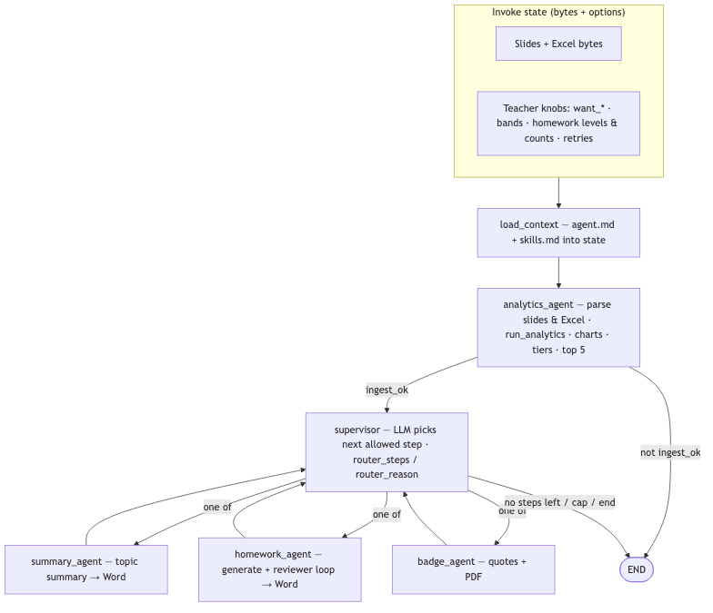

# Classroom Report & Analytics

**Repository:** [github.com/Rashpinder1985/Active-ClassTeacher-Agent](https://github.com/Rashpinder1985/Active-ClassTeacher-Agent)

Local-only tool for teachers: lecture slides (PPT/PDF) + poll responses (Excel) → topic summary (Word), poll analytics (charts), differentiated homework (with validation) via **Ollama**, and optional **top-performer badge PDFs**. The **LangGraph** pipeline: **load_context** → **analytics_agent** → **supervisor** (LLM chooses the next allowed step) → **summary_agent** / **homework_agent** / **badge_agent** in a loop until done (see flowchart below). Stack: **FastAPI** (primary), **CLI**, optional **Streamlit**. Dependencies: **[uv](https://github.com/astral-sh/uv)** — [`pyproject.toml`](pyproject.toml) / [`uv.lock`](uv.lock).

### Multi-agent flowchart 





## Prerequisites

- Python **3.10+** (3.11–3.13 recommended; 3.14 may show LangChain Pydantic warnings)
- **[uv](https://github.com/astral-sh/uv)**
- **[Ollama](https://ollama.com)** — run locally, then e.g. `ollama pull llama3.2`

## Install

```bash
cd "Classroom App"
uv sync
```

Creates `.venv` and installs the `classroom-report` package in editable mode.

## Run

| Interface | Command |
|-----------|---------|
| **API** | `uv run uvicorn app:api_app --reload --host 127.0.0.1 --port 8000` |
| **CLI** | `uv run classroom slides.pptx responses.xlsx --out-dir ./out` — add `--no-summary` / `--no-homework` to skip steps; writes `.docx` and `charts/*.json` |
| **Streamlit** | `uv run streamlit run app.py` — UI is `run_streamlit()` |

**API:** `GET /health` — status + Ollama. `POST /graph/run` (same as `/run`, `/graph/invoke`) — multipart: `slides`, `responses`; optional form fields `answer_key`, `ollama_model`, `want_summary`, `want_homework`, `anonymize`, `homework_levels_json`, `question_specs_json`. Response: `charts` with Plotly JSON **`top10`**, **`score_distribution`** (all students by score band), and **`engagement`** only for per-question (poll) sheets; **`analytics_summary`** (mean, median, std, band counts, `show_engagement`); plus `ranked_preview`, `tier_counts`, optional texts, base64 `.docx` when generated.

## Project layout

| Path | Purpose |
|------|---------|
| [`app.py`](app.py) | **Entrypoint** `api_app`, `cli_main`, `run_streamlit` for uvicorn / Streamlit / CLI |
| [`classroom_report/`](classroom_report/) | Package: `config`, `excel`, `slides`, `analytics`, `ollama`, `reports`, `loaders`, `graph`, `api`, `cli`, `streamlit_app` |
| [`agent.md`](agent.md), [`skills.md`](skills.md) | Agent memory + workflow text (injected into Ollama context) |


## File formats

**Slides** — One file per lecture. Slides whose title or first line contains Poll / Question / Quiz are treated as poll context for the summary.

**Excel** — A **student identifier** column is required (detected automatically): e.g. **Name**, **Student Name**, **Email**, **Roll No**, **Student ID**, etc. A **marks/score** column is detected by header (Total Marks, Score, Percentage, …) or, if unclear, the main numeric column beside the identifier.

- **Selected/Correct:** `Q1_Selected`, `Q1_Correct`, … (letters A–D); score 1 when selected matches correct.
- **Wide:** `Q1`, `Q2`, … as `1`/`0` or letters + optional answer key (comma-separated or first row “Key”/“Answer”).
- **Scores only (no per-question columns):** one column **obtained marks / score / percentage** (optional `Max Marks` / `Out of`). Rows are ranked and charted; values are normalized to compare fairly.

Optional samples under `templates/` (e.g. `poll_responses_example.xlsx`, `lecture_example.pptx`).

## Streamlit flow

Upload files → **Analytics** (top 10, engagement, tiers) → **Reports** (summary + homework `.docx`). Sidebar: Ollama model, anonymize top-10 names on the chart.

## Guardrails & limits

- Data stays local; homework prompts use topic + tier counts only (not student names).
- Slides max **50 MB**, Excel max **10 MB**.
  

## Troubleshooting

- **Cannot reach Ollama** — Start Ollama and `ollama pull <model>`.
- **No student column detected** — Add a clear header such as Name, Email, or Roll No (see File formats → Excel).
- **No slide text** — Use real `.pptx`/`.pdf` with selectable text, not image-only slides.


